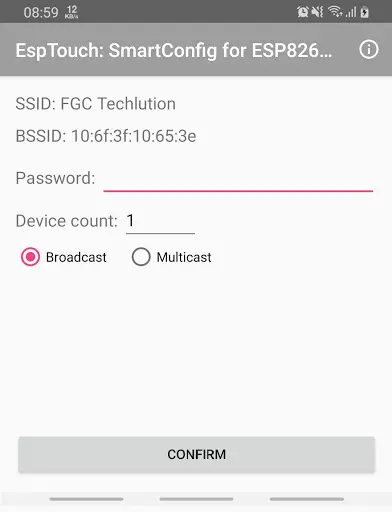

# Truyền data sử dụng giao thức MQTT

## Cách sử dụng

- Ở line số 172, dòng comment ```edit value here```, thay các sample value bằng các value nhận được từ cảm biến

  - Ví dụ như ```sensor_data.timestamp = data_sensor```

- Để cấu hình wifi cho smart config, tải app esptouch.
  > Khuyến cáo: sử dụng hệ điều hành Android


  - Sau đó kết nối tới một mạng Wifi, nhập password cho Wifi đó, để chế độ là Broadcast (em thử với Broadcast thì được, nếu không được thì chuyển sang Multicast)

  - Hình ảnh cấu hình sẽ giống dưới đây:

  


## Xem dữ liệu:

- Sử dụng MQTT client bất kì để xem dữ liệu, có thể là MQTT fx, hoặc Node-RED 
